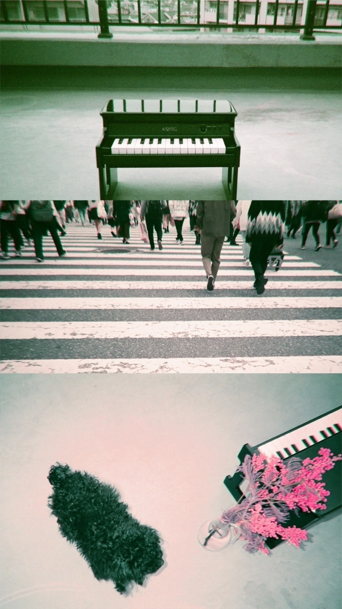

# **ブレもぼやけもあとで分かればいい**  
# **Bure mo Boyake mo Ato de Wakareba Ii**  
# **It’s Okay to Notice the Blur and Shake Later**  

といいつつ、  
To ii tsutsu,  
That being said,  

ぼけるとやはり悔しいです  
Bokeru to yahari kuyashii desu  
It’s still frustrating when things get blurry.  

.jpg)

桜を見ましたか？  
Sakura o mimashita ka?  
Did you see the cherry blossoms?  

4月になりましたね  
Shigatsu ni narimashita ne  
It’s April now.  

例年は桜っていつ満開かしらーって思いながら  
Reinen wa sakura tte itsu mankai kashira—tte omoi nagara  
Every year, I wonder when they’ll be in full bloom,  

気付いたら散ってて、逃すばかりだったのですが  
Kidzuitara chittete, nogasu bakari datta no desu ga  
Only to realize they’ve already scattered, missing them completely.  

今年はよく、見ることが出来ました。  
Kotoshi wa yoku, miru koto ga dekimashita.  
But this year, I managed to see them properly.  

今年はなるべく映画館で映画を観たいな  
Kotoshi wa narubeku eigakan de eiga o mitai na  
This year, I want to watch movies at the theater as much as possible.  

例によっていつ公開かしらと思いながら  
Rei ni yotte itsu kōkai kashira to omoi nagara  
As usual, I wonder when they’ll be released,  

気付けば上映終了してるってことが多すぎる。  
Kidzukeba jōei shūryō shiteru tte koto ga ōsugiru.  
But often realize they’ve already stopped showing by the time I notice.  

公開が楽しみな作品が2つ程あるので  
Kōkai ga tanoshimi na sakuhin ga futatsu hodo aru node  
There are about two films I’m looking forward to,  

先のページに付箋を貼るみたいに未来を心待ちに日々を捲る。  
Saki no pēji ni fusen o haru mitai ni mirai o kokoromachi ni hibi o makuru.  
Like sticking bookmarks on future pages, I look forward to what’s ahead as I turn the days.  

希望や目標は、あると豊かではあるけど、  
Kibō ya mokuhyō wa, aru to yutaka de wa aru kedo,  
Hopes and goals bring richness to life, but,  

見上げるばかりのそれは時に壁になりうるから、  
Miageru bakari no sore wa toki ni kabe ni nariuru kara,  
When they’re only things you look up to, they can sometimes become walls.  

そこへ繋がる階段を作るのが何より大切で何より難しい。  
Soko e tsunagaru kaidan o tsukuru no ga nani yori taisetsu de nani yori muzukashii.  
Building the steps to reach them is both the most important and the hardest thing to do.  

焦らないでいきましょうね  
Aseranai de ikimashō ne  
Let’s take it slow.  

と自分を宥めるような  
To jibun o nagusameru yō na  
As if comforting myself.  

新年度です  
Shin nendo desu  
It’s the start of a new year.  

宜候  
Sōrō  
Yours sincerely.  

.jpg)