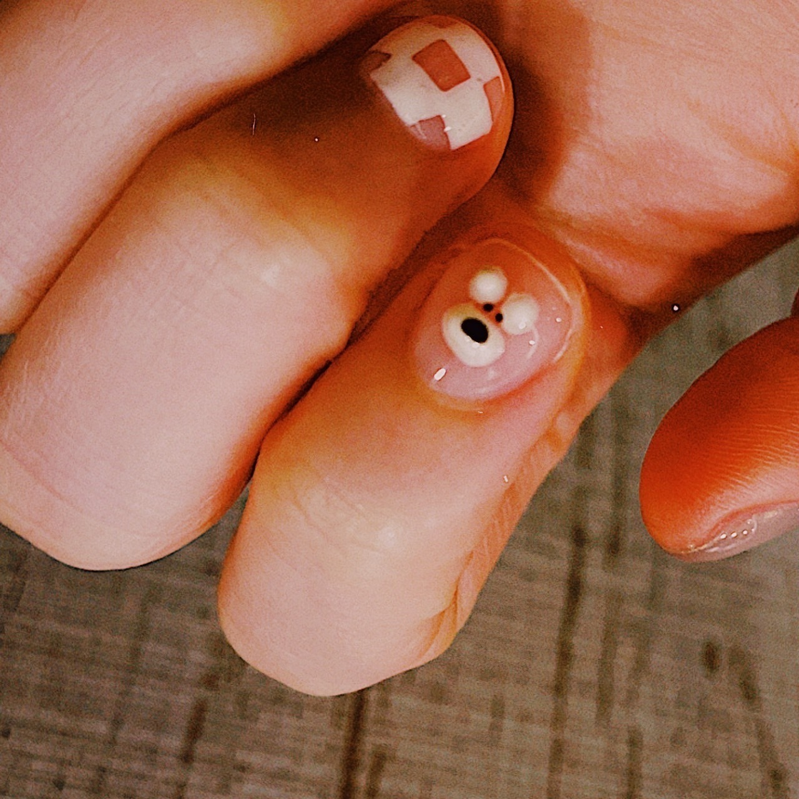

# 追加公演で演る為に新曲作ったよ  
# Tsuiyaka kouen de yaru tame ni shinkyoku tsukutta yo  
# Saya membuat lagu baru untuk konser tambahan.  

2022.04.15

ネイルをしてもらった。  
Neiru o shite moratta.  
Saya mendapatkan layanan nail art.  

INU  
Inu  
Anjing.  

私の爪を綺麗にしてくれた可愛いお姉さんは、小さい頃に天狗を見たことがあるらしい  
Watashi no tsume o kirei ni shite kureta kawaii oneesan wa, chiisai koro ni tengu o mita koto ga aru rashii  
Kakak perempuan imut yang mempercantik kuku saya katanya pernah melihat tengu saat kecil.  

誰も信じれてくれたことがないけど、と言っていた  
Dare mo shinjirete kureta koto ga nai kedo, to itte ita  
Dia bilang, tidak ada yang pernah mempercayainya.  

羽の生えた全長20cm弱の赤い天狗。  
Hane no haeta zenchou nijuu senchi yowai no akai tengu.  
Tengu merah sepanjang kurang dari 20 cm dengan sayap.  

私は信じますﾖ  
Watashi wa shinjimasu yo  
Saya percaya, lho.  

信じた方が面白いし  
Shinjita hou ga omoshiroi shi  
Percaya lebih menarik, bukan?  

私も鳥の幽霊見たことあるし  
Watashi mo tori no yuurei mita koto aru shi  
Saya juga pernah melihat hantu burung.  

透明なやつ、  
Toumei na yatsu,  
Yang transparan.  

ステルス明細みたいな  
Suterusu meisai mitai na  
Seperti kamuflase stealth.  

やつ。  
Yatsu.  
Begitulah.  

この世は知らないことばかりのはずですからね  
Kono yo wa shiranai koto bakari no hazu desu kara ne  
Dunia ini penuh dengan hal-hal yang tidak kita ketahui, bukan?  

解き明かしたいことがたくさんあります  
Tokiakashitai koto ga takusan arimasu  
Ada banyak hal yang ingin saya ungkap.  

にしても小さいおじさんを見た、ってたまに聞くやつ、  
Ni shite mo chiisai ojisan o mita, tte tama ni kiku yatsu,  
Ngomong-ngomong, saya sering mendengar cerita tentang melihat pria kecil,  

あれは本当に、一体、何者なんでしょうか？  
Are wa hontou ni, ittai, nanimono nan deshou ka?  
Sebenarnya, mereka itu siapa, ya?  

ひとまず  
Hitomazu  
Untuk saat ini,  

明日はライブです  
Ashita wa raibu desu  
Besok ada konser.  

渋谷にゆきます  
Shibuya ni yukimasu  
Saya akan ke Shibuya.  

おやすみ！  
Oyasumi!  
Selamat malam!  