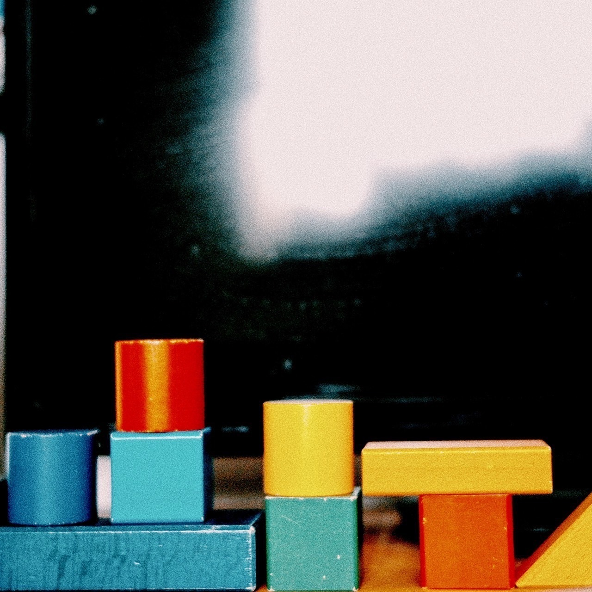

# 四月　倶楽部　春　幽霊　雨  
# Shigatsu kurabu haru yuurei ame  
# April Club, Musim Semi, Hantu, Hujan  

2022.04.27

某友人が某SNSで  
Aru yuujin ga aru SNS de  
Seorang teman saya di sebuah media sosial  

「春がもう後ろ姿」と一言、写真と共に更新していて、  
"Haru ga mou ushirosugata" to hitokoto, shashin to tomo ni koushin shite ite,  
Mengunggah satu kalimat, "Musim semi sudah berlalu," bersama foto.  

詩的な趣を感じました。  
Shiteki na omomuki o kanjimashita.  
Saya merasakan suasana yang puitis.  

友人は振り返って春の後ろ姿を眺めているんだろうか、  
Yuujin wa furikaette haru no ushirosugata o nagamete iru n darou ka,  
Apakah teman saya sedang menoleh dan melihat punggung musim semi,  

それとも春が自分を追い越していくように感じたんだろうか  
Soretomo haru ga jibun o oikoshite iku you ni kanjita n darou ka  
Ataukah ia merasa bahwa musim semi telah melewatinya?  

直接聞いてないが、想像してます。  
Chokusetsu kiitenai ga, souzou shitemasu.  
Saya tidak bertanya langsung, tetapi saya membayangkannya.  

私はゆっくりと溶けていく春の気配を見届けています。  
Watashi wa yukkuri to tokete iku haru no kehai o mitodokete imasu.  
Saya menyaksikan perlahan-lahan suasana musim semi yang memudar.  

体が透けて、だんだん見えなくなる幽霊のような感じです。  
Karada ga sukete, dandan mienakunaru yuurei no you na kanji desu.  
Seperti hantu yang tubuhnya perlahan menjadi transparan dan menghilang.  

弾き語りツアーの追加公演3本が終わりました。  
Hikigatari tsuaa no tsuika kouen sanbon ga owarimashita.  
Tiga konser tambahan dari tur akustik saya telah selesai.  

四月倶楽部　完　でございます。  
Shigatsu kurabu kan de gozaimasu.  
April Club selesai.  

追加公演はピアノ、藤井さんと二人編成でした。  
Tsuika kouen wa piano, Fujii-san to futari hensei deshita.  
Konser tambahan dilakukan berdua dengan Fujii-san di piano.  

今はライブが終わって１時間後くらいなので、  
Ima wa raibu ga owatte ichi jikan go kurai nano de,  
Sekarang sudah sekitar satu jam sejak konser selesai,  

熱を帯びてるうちにライブの感想を努めてしたためようとか思ったんですが、  
Netsu o obiteru uchi ni raibu no kansou o tsutomete shitatameyou toka omottan desu ga,  
Saya berpikir untuk segera menuliskan kesan tentang konser selagi masih bersemangat,  

やはり難しそうです。どうにも思考が内向的です。  
Yahari muzukashisou desu. Dounimo shikou ga naikouteki desu.  
Namun tampaknya sulit. Pikiran saya terlalu introspektif.  

でも、楽しいツアーでした。  
Demo, tanoshii tsuaa deshita.  
Tetapi, itu adalah tur yang menyenangkan.  

今日の歌は今日しか歌えないんだろうな、と  
Kyou no uta wa kyou shika utaenain darou na, to  
Saya merasa lagu hari ini hanya bisa dinyanyikan hari ini,  

当たり前なのかもしれないことを、しかし初めて感じました。  
Atarimae na no kamo shirenai koto o, shikashi hajimete kanjimashita.  
Hal yang mungkin biasa saja, tetapi saya merasakannya untuk pertama kali.  

しかし意外とツアーファイナルの後って余韻というよりは次のことばかりを考えてしまいます。  
Shikashi igai to tsuaa fainaru no ato tte yoin to iu yori wa tsugi no koto bakari o kangaete shimaimasu.  
Namun, setelah tur final, saya malah lebih banyak memikirkan hal berikutnya daripada terhanyut dalam suasana.  

あ  
A  
Oh.  

追加公演で新しく披露した新曲の歌詞でも載せておきます  
Tsuika kouen de atarashiku hirou shita shinkyoku no kashi demo nosete okimasu  
Saya akan memuat lirik lagu baru yang pertama kali dibawakan di konser tambahan.  

.jpg)

.png)

.png)

個人的には  
Kojinteki ni wa  
Menurut saya,  

桜が散った5月の気候は、雨上がりに少し似ている気がします  
Sakura ga chitta gogatsu no kikou wa, ame agari ni sukoshi nite iru ki ga shimasu  
Cuaca Mei setelah bunga sakura berguguran sedikit mirip dengan suasana setelah hujan reda.  

それじゃあ  
Sore jaa  
Sampai jumpa.  