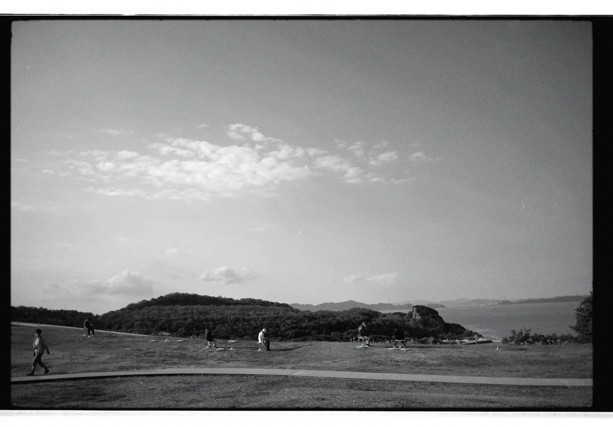

# 手紙みたいな日記  
# Tegami mitai na nikki  
# Catatan harian seperti surat  

2022.12.07

先日、瀬戸内海に旅行に行きました。  
Senjitsu, Setonaikai ni ryokou ni ikimashita.  
Beberapa waktu lalu, saya pergi berlibur ke Laut Pedalaman Seto.  

直島、豊島、小豆島  
Naoshima, Teshima, Shoudoshima  
Naoshima, Teshima, Shodoshima  

と三つの島を行ったり来たりする旅行でした。  
To mittsu no shima o ittari kitari suru ryokou deshita.  
Itu adalah perjalanan bolak-balik antara tiga pulau.  

直島の海は砂の粒子が粗くて陽に焼けたような色をしている明るい浜辺でした。  
Naoshima no umi wa suna no ryushi ga arakute hi ni yaketa you na iro o shite iru akarui hamabe deshita.  
Pantai Naoshima memiliki pasir dengan butiran kasar dan warnanya seperti terbakar matahari.  

私は一度だけ糸島に行ったことがあるんですけど、  
Watashi wa ichido dake Itoshima ni itta koto ga aru n desu kedo,  
Saya pernah sekali pergi ke Itoshima,  

あそこの海を彷彿とさせました。  
Asoko no umi o houfutsu to sasemashita.  
Dan laut di sana mengingatkan saya pada laut itu.  

小豆島の方は結構志賀島の砂に似てました。  
Shoudoshima no hou wa kekkou Shikashima no suna ni nitemashita.  
Sementara pasir di Shodoshima cukup mirip dengan pasir di Shikashima.  

砂の様子は本当にそっくり正反対です。  
Suna no yousu wa hontou ni sokkuri seihantai desu.  
Namun, keadaan pasirnya benar-benar seperti cerminan yang berlawanan.  

(糸島は福岡県西部の町で、志賀島は博多湾を挟んで糸島の対岸にある私の育った町です。)  
(Itoshima wa Fukuoka-ken seibu no machi de, Shikashima wa Hakatawan o hasande Itoshima no taigan ni aru watashi no sodatta machi desu.)  
(Itoshima adalah sebuah kota di barat Fukuoka, sedangkan Shikashima adalah kota tempat saya dibesarkan di seberang teluk Hakata dari Itoshima.)  

新しく知ったものを元々知ってるもので例えるのはなんかカッコ悪いと思いつつ、  
Atarashiku shitta mono o motomoto shitteru mono de tatoeru no wa nanka kakko warui to omoitsutsu,  
Meskipun rasanya kurang keren membandingkan sesuatu yang baru dengan sesuatu yang sudah dikenal,  

海を見た時に素直に思い出しました。  
Umi o mita toki ni sunao ni omoimashita.  
Ketika melihat laut, saya langsung teringat hal itu.  

豊島の海には触っていませんが、  
Teshima no umi ni wa sawatte imasen ga,  
Saya tidak menyentuh laut di Teshima,  

３つの島の中で一番静かで閑散とした土地でした。  
Mittsu no shima no naka de ichiban shizuka de kansen to shita tochi deshita.  
Namun, di antara ketiga pulau itu, Teshima adalah yang paling sepi dan sunyi.  

その静かさに守られるみたいに、  
Sono shizukasa ni mamorareru mitai ni,  
Seolah dilindungi oleh kesunyiannya,  

島の東端に”心臓音のアーカイブ”という建物があって、  
Shima no touhan ni "Shinzouon no Aakaibu" to iu tatemono ga atte,  
Di ujung timur pulau itu ada sebuah bangunan bernama "Arsip Suara Jantung,"  

約八万人の心臓音が保存されておりました。  
Yaku hachiman nin no shinzouon ga hozon sarete orimashita.  
Yang menyimpan sekitar 80.000 suara detak jantung.  

鼓動の音によってのみ照らされる部屋を歩きました。  
Kodou no oto ni yotte nomi terasareru heya o arukimashita.  
Saya berjalan di sebuah ruangan yang hanya diterangi oleh suara detak jantung.  

行ってみると、意味がわかると思います。  
Itte miru to, imi ga wakaru to omoimasu.  
Kalau pergi ke sana, Anda akan mengerti maksudnya.  

鼓動の音によってのみ照らされる部屋は人によっては怖く感じるかもしれません。  
Kodou no oto ni yotte nomi terasareru heya wa hito ni yotte wa kowaku kanjiru kamoshiremasen.  
Ruangan yang hanya diterangi oleh suara detak jantung itu mungkin terasa menakutkan bagi sebagian orang.  

私の後に来た女性がひとり入口で部屋に入るのを躊躇っていて、  
Watashi no ato ni kita josei ga hitori iriguchi de heya ni hairu no o tameratte ite,  
Seorang wanita yang datang setelah saya ragu-ragu untuk masuk ke ruangan di pintu masuk.  

「この部屋ちょっと怖いですね」と声を掛けて来られたので  
"Kono heya chotto kowai desu ne" to koe o kakete korareta node  
Dia berkata, "Ruangan ini agak menakutkan, ya,"  

「心臓の音が鳴ってる間は前が見えますから大丈夫ですよ。」って返して、  
"Shinzou no oto ga natteru aida wa mae ga miemasu kara daijoubu desu yo." tte kaeshite,  
Lalu saya menjawab, "Selama suara detak jantung terdengar, Anda bisa melihat ke depan, jadi tidak apa-apa."  

そしたら部屋の中に入っていかれました。  
Soshitara heya no naka ni haitte ikaremashita.  
Kemudian dia masuk ke dalam ruangan itu.  

真っ暗な間は無理に歩かなくていいと思います。  
Makkura na aida wa muri ni arukanakute ii to omoimasu.  
Menurut saya, tidak perlu memaksakan diri berjalan dalam kegelapan total.  

私もまた訪れたいと思います。  
Watashi mo mata otozuretai to omoimasu.  
Saya juga ingin mengunjungi tempat itu lagi.  

島の西側には横尾忠則館という、一軒家を模した作品としての建物があって、  
Shima no nishigawa ni wa Yokoo Tadanori-kan to iu, ikkenya o mo shita sakuhin to shite no tatemono ga atte,  
Di sisi barat pulau itu, ada sebuah bangunan bernama Museum Yokoo Tadanori yang berbentuk seperti rumah.  

そこも気に入りました。  
Soko mo ki ni irimashita.  
Saya juga menyukai tempat itu.  

入場する時に「庭に三途の川をイメージした作品が有りますが、  
Nyuujo suru toki ni "Niwa ni Sanzu no Kawa o imeeji shita sakuhin ga arimasu ga,  
Saat masuk, saya diberi tahu, "Di taman ada karya seni yang menggambarkan Sungai Sanzu,  

作品なので、渡らないでください」と注意されたのがよかった。  
Sakuhin na node, wataranaide kudasai" to chuui sareta no ga yokatta.  
Namun karena itu adalah karya seni, mohon jangan menyebrangi sungai tersebut," dan saya merasa itu menarik.  