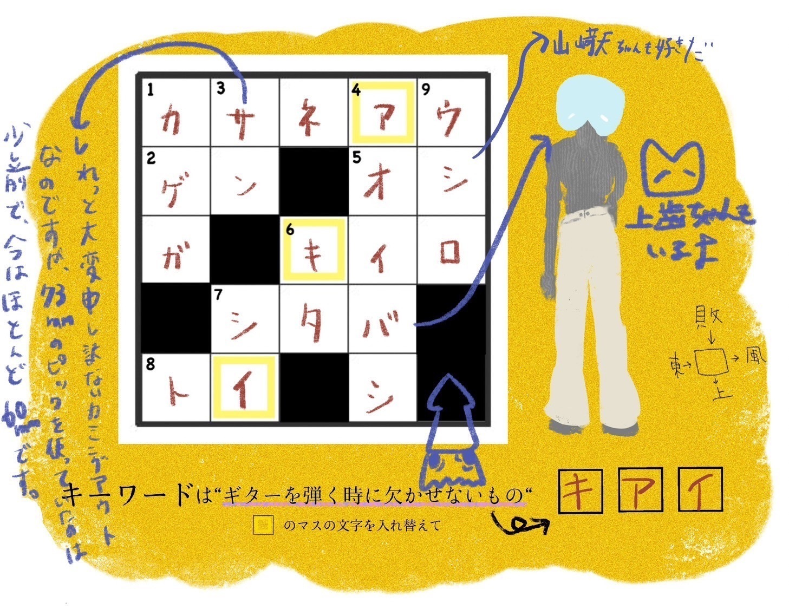

# クロスワードプレゼント企画のこと  
# Kurosuwaado purezento kikaku no koto  
# Tentang proyek hadiah teka-teki silang  

2023.02.15

こんにちは  
Konnichiwa  
Halo  

YELLOW一周年記念で催した、  
YELLOW isshuunen kinen de moyou shita,  
Sebagai perayaan satu tahun YELLOW,  

クロスワードプレゼント企画の当選者がついに決定しました〜！  
Kurosuwaado purezento kikaku no tousensha ga tsui ni kettei shimashita~!  
Pemenang proyek hadiah teka-teki silang akhirnya diputuskan!  

当選者にはスタッフからメールが届くと思うのでお楽しみにしててねー  
Tousensha ni wa sutaffu kara meeru ga todoku to omou node otanoshimi ni shite te ne~  
Para pemenang akan menerima email dari staf, jadi tunggu kabar baiknya, ya!  

そして参加してくれた人ありがとう。  
Soshite sanka shite kureta hito arigatou.  
Terima kasih kepada semua yang telah berpartisipasi.  

クロスワードの回答も載せておくね  
Kurosuwaado no kaitou mo nosete oku ne  
Jawaban teka-teki silang juga akan saya bagikan.  

。。。  
...  
...  

どうでしょうかね  
Dou deshou ka ne  
Bagaimana menurut kalian?  

全問正解しましたかね  
Zenmon seikai shimashita ka ne  
Apakah kalian menjawab semua dengan benar?  

まさかね  
Masaka ne  
Tidak mungkin, kan?  

気合いだなんてね  
Kiai da nante ne  
Semangat, katanya.  

ギターを弾くのに必要なものが  
Gitaa o hiku no ni hitsuyou na mono ga  
Hal yang diperlukan untuk bermain gitar.  

気合いだなんてね  
Kiai da nante ne  
Semangat, katanya.  

初めてクロスワードパズル作ったけど、楽しかったです。  
Hajimete kurosuwaado pazuru tsukutta kedo, tanoshikatta desu.  
Ini pertama kalinya saya membuat teka-teki silang, dan itu menyenangkan.  

みんなも遊び心で作ってみたらいいかもしれません  
Minna mo asobigokoro de tsukutte mitara ii kamo shiremasen  
Mungkin kalian juga bisa mencoba membuatnya untuk bersenang-senang.  

文字数の制限と五十音の位置合わせたりなんかが、  
Mojisu no seigen to gojuuon no ichi awasetari nanka ga,  
Membatasi jumlah huruf dan menyesuaikan posisi suku kata,  

ほんの少し作詞にも似てました。  
Hon no sukoshi sakushi ni mo nite mashita.  
Agak mirip dengan menulis lirik lagu.  

そして  
Soshite  
Dan kemudian,  

先週末には弾き語りツアーがスタートしました。  
Senshuumatsu ni wa hikigatari tsuaa ga sutaato shimashita.  
Akhir pekan lalu, tur solo akustik saya telah dimulai.  

初日は大阪梅田。初めてのライブハウスQUATTROでした  
Hatsuhi wa Osaka Umeda. Hajimete no raibuhausu QUATTRO deshita  
Hari pertama di Osaka Umeda. Ini pertama kalinya saya tampil di live house QUATTRO.  

.jpg)

リハ中の客席に並んだ脚立が鉄塔っぽかったです  
Riha chuu no kyakuseki ni naranda kyakudachi ga tettou-ppokatta desu  
Tangga yang berjajar di antara kursi penonton saat latihan tampak seperti menara baja.  

次は東京渋谷だよーーー  
Tsugi wa Toukyou Shibuya da yo---  
Selanjutnya adalah Tokyo Shibuya!  

最後に  
Saigo ni  
Sebagai penutup,  

ボーデ近影  
Boode kin’ei  
Potret terbaru dari Boede. 

.jpg)