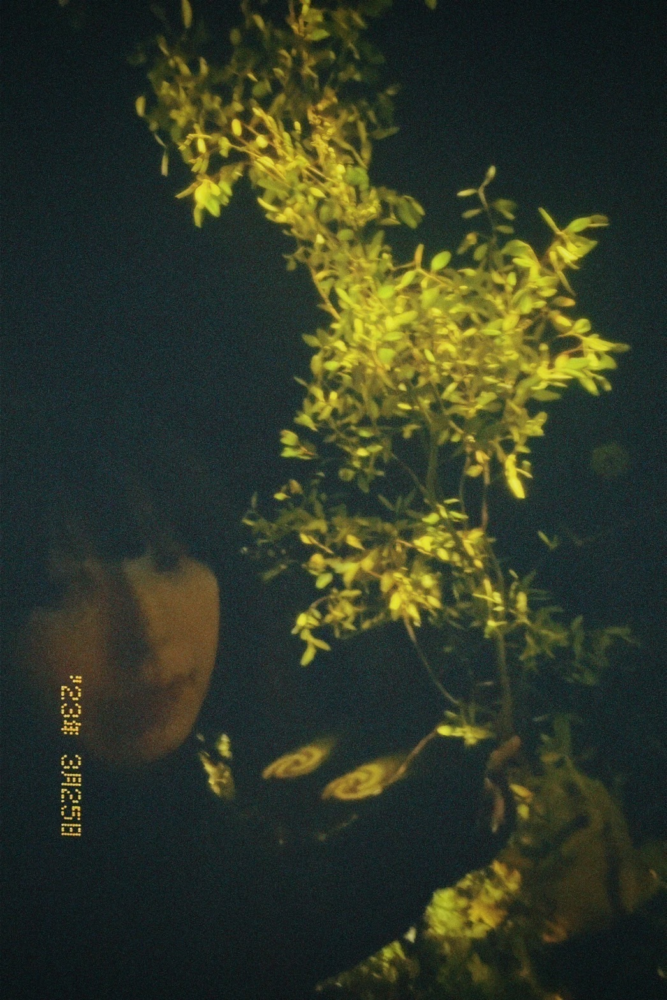

# ツアーファイナルで撮った写真たちの供養  
# Tsuaa fainaru de totta shashin-tachi no kuyo  
# Mengenang foto-foto yang diambil saat tur final  

2023.03.30

.jpg)

.jpg)

.jpg)

.jpg)

緑に囲まれた酸欠衝動  
Midori ni kakomareta sanketsu shoudou  
Dikelilingi oleh kehijauan, dorongan untuk bernapas terasa kuat  

植物たちの酸素をいただくような気持ちで  
Shokubutsu-tachi no sanso o itadaku you na kimochi de  
Dengan perasaan seolah menerima oksigen dari tumbuhan  

たくさん歌を歌いました。  
Takusan uta o utaimashita.  
Saya menyanyikan banyak lagu.  

このステージセットとの別れを惜しみ不用意な自撮りを連発しました。  
Kono suteeji setto to no wakare o oshimi fuyoui na jidori o renpatsu shimashita.  
Saya mengambil banyak swafoto tanpa rencana, merasa berat berpisah dengan set panggung ini.  

まともなライブ写真はマネージャーの撮ってくれたものを楽しんでください。  
Matomo na raibu shashin wa manejaa no totte kureta mono o tanoshinde kudasai.  
Nikmati foto-foto panggung yang bagus hasil jepretan manajer.  

来てくれた方、ありがとうございました。  
Kite kureta kata, arigatou gozaimashita.  
Terima kasih kepada semua yang telah datang.  

昨年のバンドツアーと同名で催したけれどセットリストはガラッと変わり！  
Sakunen no bando tsuaa to doumei de moyou shita keredo setto risuto wa garatto kawari!  
Meskipun tur ini memiliki nama yang sama dengan tur band tahun lalu, daftar lagunya benar-benar berbeda!  

弾き語りでは新旧織り交ぜた曲たちを演奏しました。  
Hikigatari de wa shinkyuu orimazeta kyoku-tachi o ensou shimashita.  
Dalam format solo akustik, saya memainkan lagu-lagu baru dan lama secara bergantian.  

バンドと弾き語りで番のようなイメージを持って、  
Bando to hikigatari de ban no you na imeeji o motte,  
Dengan bayangan seperti pasangan antara band dan solo akustik,  

両方やり遂げてようやく酸欠衝動を終えられたような気がします。  
Ryouhou yaritogete youyaku sanketsu shoudou o oerareta you na ki ga shimasu.  
Setelah menyelesaikan keduanya, akhirnya saya merasa dorongan untuk bernapas ini selesai.  

ライブとは元来そういうものなのでわざわざいうことでは無いが、  
Raibu to wa gonkai sou iu mono nano de wazawaza iu koto de wa nai ga,  
Konser memang pada dasarnya seperti itu, jadi mungkin tidak perlu dikatakan lagi,  

きっともう同じような歌は歌えないと、特に強く思うツアーでした。  
Kitto mou onaji you na uta wa utaenai to, tokuni tsuyoku omou tsuaa deshita.  
Namun ini adalah tur yang membuat saya sangat yakin bahwa saya tidak akan bisa menyanyikan lagu yang sama lagi.  

声出しが解禁されてみんなと久しぶりにMCで会話が出来て嬉しかったなー  
Koedashi ga kaikin sarete minna to hisashiburi ni MC de kaiwa ga dekite ureshikatta naa  
Senang sekali akhirnya bisa berbicara dengan semua orang selama MC setelah sekian lama.  

また会いましょうね  
Mata aimashou ne  
Mari bertemu lagi, ya.  

次回に期待していてください。  
Jikai ni kitai shite ite kudasai.  
Tunggu kejutan untuk kesempatan berikutnya.  