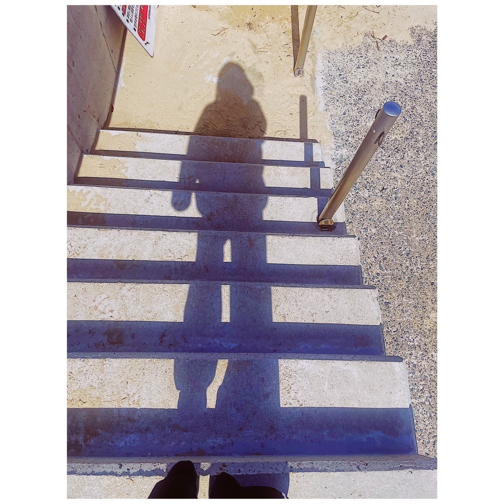

# 福岡の思い出です  
# Fukuoka no Omoide desu  
# Kenangan di Fukuoka

2023.03.31

先日の福岡公演の後に会いたい友達に会うために連泊をしていました。  
**Senjitsu no Fukuoka kouen no ato ni aitai tomodachi ni au tame ni renpaku o shite imashita.**  
Setelah konser di Fukuoka beberapa waktu lalu, saya menginap beberapa hari untuk bertemu teman yang ingin saya temui.  

福岡では、やはり海を見ました。  
**Fukuoka de wa, yahari umi o mimashita.**  
Di Fukuoka, seperti biasa, saya melihat laut.  

福岡には何があるのかと問われれば海があります。  
**Fukuoka ni wa nani ga aru no ka to towareba umi ga arimasu.**  
Kalau ditanya apa yang ada di Fukuoka, jawabannya adalah laut.  

特別綺麗でも汚くもない、特徴などけどかけがえもない湾です。  
**Tokubetsu kirei demo kitanaku mo nai, tokuchou nado kedo kakegae mo nai wan desu.**  
Teluknya tidak terlalu indah atau terlalu kotor, biasa saja, tapi tetap tak tergantikan.  

その穴ぼこみたいな湾を眺めながら育ちました。  
**Sono anaboko mitai na wan o nagamenagara sodatshimashita.**  
Saya tumbuh besar dengan memandang teluk yang mirip lubang itu.  

だから私の命はそこから産まれたような気がします  
**Dakara watashi no inochi wa soko kara umareta you na ki ga shimasu.**  
Makanya, saya merasa hidup saya seolah lahir dari sana.  

これは色々な比喩です。  
**Kore wa iroiro na hiyu desu.**  
Ini adalah berbagai macam metafora.  

海が好きです。  
**Umi ga suki desu.**  
Saya suka laut.  

スリランカカレーも食べました。  
**Suriranka karee mo tabemashita.**  
Saya juga makan kari Sri Lanka.  

美味しかったです。  
**Oishikatta desu.**  
Rasanya enak.  

スリランカカレーの写真はありません。  
**Suriranka karee no shashin wa arimasen.**  
Tidak ada foto kari Sri Lanka-nya.  

こうやって考えると私は記憶の行間を埋めるような写真ばかり撮っていて、  
**Kou yatte kangaeru to watashi wa kioku no gyoukan o umeru you na shashin bakari totte ite,**  
Kalau dipikir-pikir, saya hanya memotret foto yang mengisi "celah kenangan",  

文字に起こせる、出来事に付随した写真をかなり撮り損ねていますね。  
**Moji ni okoseru, dekigoto ni fuzui shita shashin o kanari torisonete imasu ne.**  
Dan sering melewatkan foto yang bisa dijelaskan dengan cerita atau kata-kata.  

.jpg)

.jpg)

たまたま入った「おまめ」という喫茶店がかなり雰囲気が良くて、  
**Tamatama haitta "Omame" to iu kissaten ga kanari fun'iki ga yokute,**  
Saya kebetulan masuk ke kafe bernama "Omame" yang suasananya sangat menyenangkan,  

飲み物が美味しくて、大変気に入ってしまいました。  
**Nomimono ga oishikute, taihen kiniitte shimaimashita.**  
Minumannya enak, dan saya benar-benar menyukainya.  

近所にあれば毎日行くのに。  
**Kinjo ni areba mainichi iku noni.**  
Kalau ada di dekat rumah, pasti saya ke sana setiap hari.  

また福岡帰った時はすぐに寄りたいです。  
**Mata Fukuoka kaetta toki wa sugu ni yoritai desu.**  
Ketika kembali ke Fukuoka, saya ingin langsung mampir lagi.  

おまめの写真はありません。  
**Omame no shashin wa arimasen.**  
Tidak ada foto "Omame".  

しかし星の写真はあります。  
**Shikashi hoshi no shashin wa arimasu.**  
Namun, ada foto bintang.  

iphone12でこんなにも映るんですね。  
**iPhone 12 de konna ni mo utsurun desu ne.**  
Saya tak menyangka bisa sejelas ini dengan iPhone 12.  

これは小石原という場所の空です。  
**Kore wa Toishiwara to iu basho no sora desu.**  
Ini adalah langit di tempat bernama Toishiwara.  

個人的にゆかりのある小石原小学校に行きたかったんですが、  
**Kojinteki ni yukari no aru Toishiwara Shougakkou ni ikitakatta n desu ga,**  
Saya ingin pergi ke SD Toishiwara yang punya kenangan pribadi,  

廃校になっていて、校舎がグランピング施設になっていました。  
**Haikou ni natte ite, kousha ga glamping shisetsu ni natte imashita.**  
Tapi sekolahnya sudah tutup dan bangunannya dijadikan fasilitas glamping.  

.jpg)

北斗七星みえますか？  
**Hokuto Shichisei miemasu ka?**  
Bisa lihat Rasi Bintang Biduk?  

おわり  
**Owari**
Selesai.  