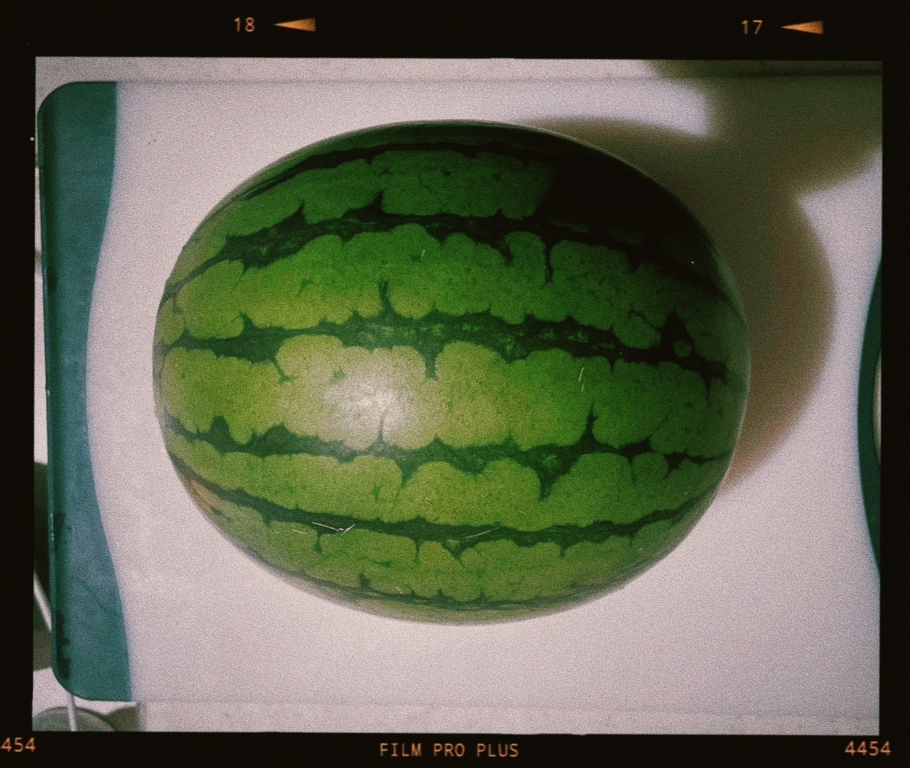

# 眠れるようになった  
# Nemureru You ni Natta  
# Akhirnya Bisa Tidur Nyenyak

2023.05.30

お久しぶりです。長らく更新しておらずごめんなさい！  
**Ohisashiburi desu. Nagaraku koushin shite orazu gomen nasai!**  
Sudah lama tidak menyapa. Maaf karena lama tidak mengupdate apa pun!  

季節はあっという間に梅雨に差し掛かろうとしていますね。  
**Kisetsu wa atto iu ma ni tsuyu ni sashikakarou to shiteimasu ne.**  
Musim ini rasanya sudah cepat sekali menuju musim hujan.  

わたしは住む環境が変わって、慌ただしく生活を整える為の生活をしておりましたが  
**Watashi wa sumu kankyou ga kawatte, awatadashiku seikatsu o totonoeru tame no seikatsu o shite orimashita ga**  
Saya pindah lingkungan tempat tinggal, dan selama ini sibuk mengatur ulang kehidupan untuk menyesuaikan diri,  

ようやく落ち着くことができました。  
**Youyaku ochitsuku koto ga dekimashita.**  
Akhirnya sekarang bisa merasa lebih tenang.  

西瓜も食べました。いいでしょ。  
**Suika mo tabemashita. Ii desho.**  
Saya juga sudah makan semangka. Bagus, kan?  

夏が来る前に一番夏らしいことをしてしまいました。  
**Natsu ga kuru mae ni ichiban natsu rashii koto o shite shimaimashita.**  
Sebelum musim panas benar-benar tiba, saya sudah melakukan hal paling musim panas.  

飼い犬のボーデは2歳になりました。  
**Kaiinu no Boode wa 2-sai ni narimashita.**  
Anjing peliharaan saya, Boode, sudah berusia 2 tahun.  

彼女は相変わらず可愛く、毎日初めての感情を覚えるかのように新鮮に愛おしいです。  
**Kanojo wa aikawarazu kawaiku, mainichi hajimete no kanjou o oboeru ka no you ni shinsen ni itooshii desu.**  
Dia tetap menggemaskan seperti biasa, dan setiap hari rasanya seperti merasakan cinta baru yang segar.  

.jpg)

変わったことといえば  
**Kawatta koto to ieba**  
Hal yang berubah belakangan ini,  

長らくお香派だったのがディフューザー派に変わりました。  
**Nagaraku okou-ha datta no ga difyuuzaa-ha ni kawarimashita.**  
Saya yang dulu pencinta aroma dupa kini beralih ke diffuser.  

アポテーケの24K ROSEと、DENCEを使っています。  
**Apoteeke no 24K ROSE to, DENCE o tsukatteimasu.**  
Saya sedang memakai aroma 24K ROSE dan DENCE dari Apotheke.  

最近は、価値についてよく考えます。  
**Saikin wa, kachi ni tsuite yoku kangaemasu.**  
Belakangan, saya sering memikirkan tentang "nilai".  

ものごとの、私にとっての価値です。  
**Monogoto no, watashi ni totte no kachi desu.**  
Nilai dari segala sesuatu, khususnya menurut pandangan saya.  

価値観を世間様と答え合わせする際に、満点は貰えずとも高い点を貰えるように務めるべきと  
**Kachikan o seken-sama to kotaeawase suru sai ni, manten wa moraezu to mo takai ten o moraeru you ni tsutomeru beki to**  
Saat mencoba mencocokkan pandangan nilai saya dengan standar masyarakat,  

やってみたもののかなり無理がありました。とってもお腹が痛くなりました。  
**Yattemita mono no kanari muri ga arimashita. Tottemo onaka ga itaku narimashita.**  
Saya berusaha melakukannya, tetapi ternyata itu terlalu berat. Rasanya sampai sakit perut.  

私にとっての価値は、案外私だけのものです。  
**Watashi ni totte no kachi wa, angai watashi dake no mono desu.**  
Nilai menurut saya ternyata adalah sesuatu yang cukup personal.  

私は美しいものが好きです。  
**Watashi wa utsukushii mono ga suki desu.**  
Saya suka hal-hal yang indah.  

世の中には美しいものがいっぱいあるけど、その中で比較したときに、  
**Yononaka ni wa utsukushii mono ga ippai aru kedo, sono naka de hikaku shita toki ni,**  
Dunia ini penuh dengan keindahan, tetapi saat dibandingkan,  

私にとっての優劣がはっきりとあったり、発見があっておもしろいです。  
**Watashi ni totte no yuuretsu ga hakkiri to attari, hakken ga atte omoshiroi desu.**  
Ada kejelasan mana yang lebih berharga bagi saya, dan itu menarik.  

たとえば見た目の綺麗な人はもちろん好きだけど、それより私にとって価値があるのは  
**Tatoeba mitame no kirei na hito wa mochiron suki dakedo, sore yori watashi ni totte kachi ga aru no wa**  
Misalnya, saya suka orang yang menarik secara fisik, tapi yang lebih bernilai bagi saya adalah  

物語の中に綺麗な景色を描ける人です。みたいな風に。  
**Monogatari no naka ni kirei na keshiki o egakeru hito desu. Mitai na fuu ni.**  
Orang yang bisa melukiskan pemandangan indah dalam sebuah cerita. Seperti itu.  

あと、夜にちゃんと眠れるようになりました。  
**Ato, yoru ni chanto nemureru you ni narimashita.**  
Oh ya, saya sekarang bisa tidur nyenyak di malam hari.  

好んで夜更かしもする時があるけど、健康的な時間に眠れるのも悪くない気がしてます。  
**Konomu de yofukashi mo suru toki ga aru kedo, kenkouteki na jikan ni nemureru no mo warukunai ki ga shitemasu.**  
Kadang saya masih sengaja begadang, tapi tidur di jam yang sehat rasanya juga tidak buruk.  

もうすぐ６月だねー  
**Mou sugu 6-gatsu da ne—**  
Sebentar lagi sudah bulan Juni ya.  

雨がたくさん！降ります！  
**Ame ga takusan! Furimasu!**  
Hujan akan turun banyak!  