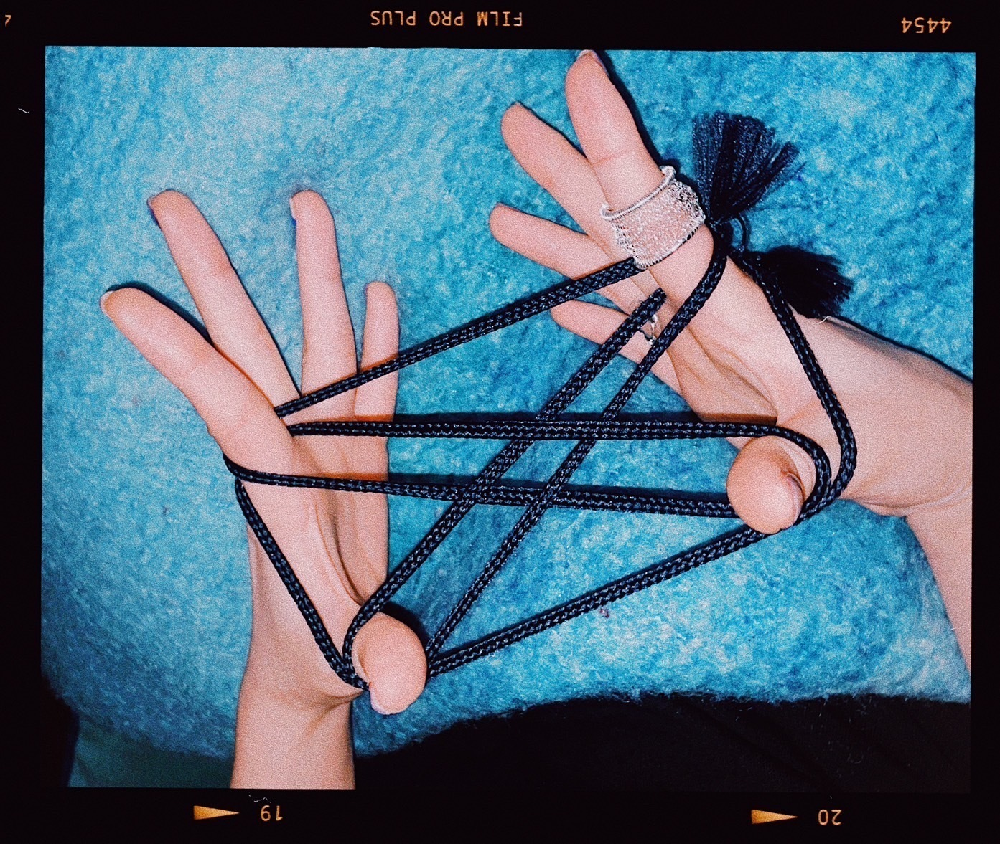

# あやとり
# AYATORI  

2023.07.10

部屋着の短パンの紐が外れたので  
Heyagi no tanpan no himo ga hazureta node  
Tali celana pendek baju rumahku terlepas,  

20年ぶりにあやとりをしました  
20-nen buri ni ayatori o shimashita  
Jadi aku bermain ayatori lagi setelah 20 tahun.  

あやとりには指環が邪魔ということを知る。  
Ayatori ni wa yubiwa ga jama to iu koto o shiru.  
Aku sadar bahwa cincin mengganggu saat bermain ayatori.  

あの頃は指環なんて付けて無かったもんね  
Ano koro wa yubiwa nante tsukete nakatta mon ne  
Dulu aku tidak pernah memakai cincin.  

記憶を掘り起こして試行錯誤してたら意外と形になったのが驚きだ。体の記憶とは恐ろしい。  
Kioku o horiokoshite shikou sakugo shitara igai to katachi ni natta no ga odoroki da. Karada no kioku to wa osoroshii.  
Menggali ingatan dan mencoba-coba, aku terkejut ternyata bentuknya masih bisa dibuat. Memori tubuh itu luar biasa.  

.jpg)

新しく仲間になった指環は  
Atarashiku nakama ni natta yubiwa wa  
Cincin baru yang menjadi temanku ini  

ポルトガルのアクセサリー作家の手編みらしい。  
Porutogaru no akusesarī sakka no teami rashii.  
Kabarnya buatan tangan seorang pembuat perhiasan dari Portugal.  

イネスソブレイラ？  
Inesu Sobureira?  
Inês Sobreira?  

良い名前だね、シルバーの糸だって。  
Yoi namae da ne, shirubā no ito datte.  
Nama yang bagus, katanya terbuat dari benang perak.  

近所で買った。ポルトガルってどんな場所だろう。  
Kinjo de katta. Porutogaru tte donna basho darou.  
Aku membelinya di dekat sini. Seperti apa ya Portugal itu?  

＊  

７月になりましたね。  
Shichigatsu ni narimashita ne.  
Sudah bulan Juli ya.  

お日様がでてる間は意地でも外に出てやんない、と意気込んでます。  
Ohisama ga deteru aida wa iji demo soto ni dete yan'nai, to ikigonde masu.  
Aku bersikeras tidak akan keluar saat matahari bersinar.  

でも先月からうちに来た観葉植物のエバーフレッシュには日光を浴びさせなきゃいけないから、  
Demo sengetsu kara uchi ni kita kanyou shokubutsu no Ebāfuresshu ni wa nikkou o abisasenakya ikenai kara,  
Tapi, aku harus memberikan sinar matahari kepada tanaman hias Everfresh yang datang bulan lalu.  

日中はリビングのカーテンを開けてあげて、その間私は逃げるように別の部屋に立てこもる。  
Nichuu wa ribingu no kāten o akete agete, sono aida watashi wa nigeru you ni betsu no heya ni tatekomoru.  
Jadi, di siang hari aku membuka tirai ruang tamu untuknya, lalu aku berlindung di kamar lain.  

立派な共存関係を結んでいます。譲り合いです。  
Rippa na kyouzon kankei o musunde imasu. Yuzuriai desu.  
Kami menjalin hubungan simbiosis yang indah. Saling berbagi.  

エバーフレッシュには実は名前がついていて、エブリンと言います。  
Ebāfuresshu ni wa jitsu wa namae ga tsuite ite, Eburin to iimasu.  
Sebenarnya, Everfresh punya nama, yaitu Evelyn.  

ぜひ名前をつけて可愛がってください。と、植物も人とおんなじで触ったり声をかけると元気になるから。と選んでくれた植物屋さんのモンドさんが言っていたからです。  
Zehi namae o tsukete kawaigatte kudasai. To, shokubutsu mo hito to on'naji de sawattari koe o kakeru to genki ni naru kara. To erande kureta shokubutsuya-san no Mondo-san ga itte ita kara desu.  
"Tolong beri nama dan sayangi tanaman ini," kata Mondo, pemilik toko tanaman yang memilihkannya untukku.  

植物に名前つけるの割と小っ恥ずかしかったんですがプロがそういうなら、ということで名付けました。  
Shokubutsu ni namae tsukeru no warito choppazukashikatta n desu ga puro ga sou iu nara, to iu koto de nadzukemashita.  
Awalnya agak malu memberi nama pada tanaman, tapi karena itu saran seorang profesional, aku memberinya nama.  

由来は、  
Yurai wa,  
Asalnya,  

トミーのことをトムって呼ぶみたいな、エバーの愛称っぽい響きだったのが一つと、  
Tomī no koto o Tom tte yobu mitai na, Ebā no aishou-ppoi hibiki datta no ga hitotsu to,  
Seperti memanggil Tommy dengan Tom, terdengar seperti nama panggilan untuk Ever.  

フランス語で“生き生きとした”という意味がぴったりだと思ったのが一つ。  
Furansugo de "ikiiki to shita" to iu imi ga pittari da to omotta no ga hitotsu.  
Dan satu lagi, dalam bahasa Prancis artinya “hidup dan segar,” yang terasa sangat cocok.  

ボーデもフランス語が由来なので、おそろいです。  
Bōde mo Furansugo ga yurai na node, osoroi desu.  
Boude juga berasal dari bahasa Prancis, jadi serasi.  

迎え入れて1ヶ月ちょっとだけど、気づいたらかなり繁茂している気がする。  
Mukaeirete ikkagetsu chotto dakedo, kidzuitara kanari hanmo shite iru ki ga suru.  
Baru sebulan sejak ia datang, tapi rasanya sudah tumbuh sangat subur.  

成長速度早いから多分エブリン絶対観葉じゃないよ。  
Seichou sokudo hayai kara tabun Eburen zettai kanyou janai yo.  
Pertumbuhannya cepat, jadi Evelyn pasti bukan hanya tanaman hias biasa.  

そいえば  
Soieba  
Ngomong-ngomong,  

普段テレビを殆ど見ないんだけど、  
Fudan terebi o hotondo minai n da kedo,  
Aku hampir tidak pernah menonton TV,  

直近2回、たまたま電源付けた時に映ったのがどっちともお笑い番組で、  
Chokkin ni kai, tamatama dengen tsuketa toki ni utsutta no ga docchi tomo owarai bangumi de,  
Dua kali belakangan ini, kebetulan saat menyalakan TV, yang muncul adalah acara komedi.  

どっちも謎のピザのダンスをする芸人のネタの最中だった。  
Docchi mo nazo no piza no dansu o suru geinin no neta no saichuu datta.  
Keduanya sedang menampilkan komedi dengan tarian pizza yang aneh.  

1回目は急にピザダンス始められて訳わかんなかったけど、2回目はこの前見たやつだとなってすんなり入ってきたしなんなら結構癖になってしまった。  
Ikkai-me wa kyuu ni piza dansu hajimerarete wake wakannakatta kedo, ni kai-me wa kono mae mita yatsu da to natte sunnari haitte kita shi nannara kekkou kuse ni natte shimatta.  
Pertama kali aku bingung karena tiba-tiba ada tarian pizza, tapi di kali kedua aku langsung mengenalinya, bahkan mulai menyukainya.  

人は繰り返し観ると見慣れて好きになっていくみたいなのどっかで見たことあるけど、  
Hito wa kurikaeshi miru to minarete suki ni natte iku mitai na no dokka de mita koto aru kedo,  
Katanya, manusia akan terbiasa dan mulai menyukai sesuatu jika sering melihatnya,  

本当なんだなあと思った。といっても2回だけど。偶然が重なると特別になりますね。  
Hontou na n da naa to omotta. To itte mo ni kai dake dakedo. Guuzen ga kasanaru to tokubetsu ni narimasu ne.

  
Dan itu ternyata benar. Meskipun baru dua kali, kebetulan berulang memang membuat sesuatu jadi istimewa.  

ツンツクツン万博というコンビらしいです。  
Tsuntsukutsun Banpaku to iu konbi rashii desu.  
Kabarnya, mereka adalah duo bernama Tsuntsukutsun Banpaku.  