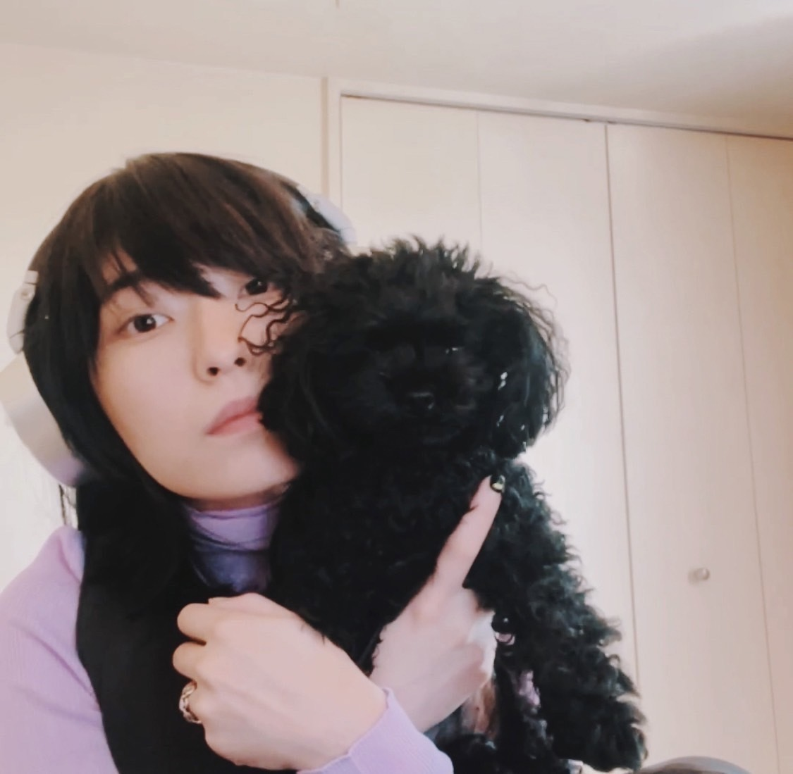

# かいふく  
# Kaifuku  
# Pemulihan  

2023.09.29

やほ  
Yaho  
Hei!  

クリーニング屋が定休日だったから木曜日、  
Kurīningu-ya ga teikyūbi datta kara mokuyōbi,  
Karena tempat laundry tutup pada hari libur, jadi Kamis,  

久しぶりにしっかりと壊した体調はもうほとんど治った。  
Hisashiburi ni shikkari to kowashita taichō wa mō hotondo naotta.  
Setelah sekian lama, akhirnya kondisi tubuhku yang sempat drop hampir sepenuhnya pulih.  

鼻声も多分無くなった。  
Hanagoe mo tabun nakunatta.  
Hidung tersumbatku juga mungkin sudah hilang.  

youtubeで、色んな人の旅の動画を沢山観て面白かったけど、  
Youtube de, ironna hito no tabi no dōga o takusan mite omoshirokatta kedo,  
Di YouTube, aku menonton banyak video perjalanan orang lain, dan itu menyenangkan,  

だんだん自分の人生から自分が遠ざかっていく気がして怖くなった。  
Dandan jibun no jinsei kara jibun ga tōzakatte iku ki ga shite kowaku natta.  
Tapi lama-kelamaan, aku merasa seperti menjauh dari hidupku sendiri, dan itu membuatku takut.  

行きたい所には自分の足で行った方が当たり前だけど良くて、  
Ikitai tokoro ni wa jibun no ashi de itta hō ga atarimae dakedo yokute,  
Memang seharusnya tempat yang ingin kudatangi lebih baik kucapai dengan langkahku sendiri,  

だけど映像を観ただけで行った気になって満足してしまいそうなのがおそろしくてやめた。  
Dakedo eizō o mita dake de itta ki ni natte manzoku shite shimaisō nano ga osoroshikute yameta.  
Namun, aku takut jika hanya dengan menonton video, aku merasa sudah pergi dan puas, jadi aku berhenti.  

映画の予告、  
Eiga no yokoku,  
Trailer film,  

映画の予告ははなるべく観たくない方です。  
Eiga no yokoku wa narubeku mitakunai hō desu.  
Aku lebih suka tidak menonton trailer film.  

展開を予測してその映画から得られるものを勝手に期待して狭めてしまうのがとても嫌です。  
Tenkai o yosoku shite sono eiga kara erareru mono o katte ni kitai shite sebamete shimau no ga totemo iya desu.  
Aku tidak suka memprediksi alur cerita dan secara tidak sadar mempersempit ekspektasi terhadap apa yang bisa kudapatkan dari film itu.  

それでも楽しめるけどね、  
Sore demo tanoshimeru kedo ne,  
Meski begitu, aku tetap bisa menikmatinya,  

予告を観て興味が湧いた結果観てよかったと思える出会いもあるけど、  
Yokoku o mite kyōmi ga waita kekka mite yokatta to omoeru deai mo aru kedo,  
Kadang menonton trailer membuatku tertarik dan merasa beruntung menontonnya,  

逆に予告で分かった気になってしまって観なかった映画もあるだろうな。  
Gyaku ni yokoku de wakatta ki ni natte shimatte minakatta eiga mo aru darou na.  
Tapi ada juga film yang mungkin tidak kutonton karena merasa sudah tahu dari trailernya.  

準備も予測もせずに生身で飛び込みたいですね、映画にも世界のあらゆる感動にも。  
Junbi mo yosoku mo sezu ni namami de tobikomitai desu ne, eiga ni mo sekai no arayuru kandō ni mo.  
Aku ingin menyelami semua keajaiban, baik dalam film maupun dunia, tanpa persiapan atau prediksi apa pun.  

.jpg)

そういえばギターのピックを前回のライブから変えた。  
Sō ieba gitā no pikku o zenkai no raibu kara kaeta.  
Ngomong-ngomong, aku mengganti pick gitarku sejak live terakhir.  

60mmから100mmになった。  
60 mm kara 100 mm ni natta.  
Dari 60mm menjadi 100mm.  

ピックを触ったことがない人からするとどのくらいの差があるのか  
Pikku o sawatta koto ga nai hito kara suru to dono kurai no sa ga aru no ka  
Bagi orang yang belum pernah memegang pick, mungkin tidak tahu seberapa besar perbedaannya,  

全然分からないと思うけど、この厚みの差はかなりある。  
Zenzen wakaranai to omou kedo, kono atsumi no sa wa kanari aru.  
Tapi perbedaan ketebalannya cukup besar.  

グミでいうところの果汁グミとハードグミぐらい硬さが違う。  
Gumi de iu tokoro no kajū gumi to hādo gumi gurai katasa ga chigau.  
Seperti perbedaan antara gummy biasa dan gummy keras.  

弾き心地が違うなら音だって違う。  
Hikigokochi ga chigau nara oto datte chigau.  
Jika rasanya berbeda saat dimainkan, tentu suaranya juga berbeda.  

今の音の方が今の気持ちに合っている気がする。  
Ima no oto no hō ga ima no kimochi ni atte iru ki ga suru.  
Suara yang sekarang rasanya lebih cocok dengan perasaanku saat ini.  