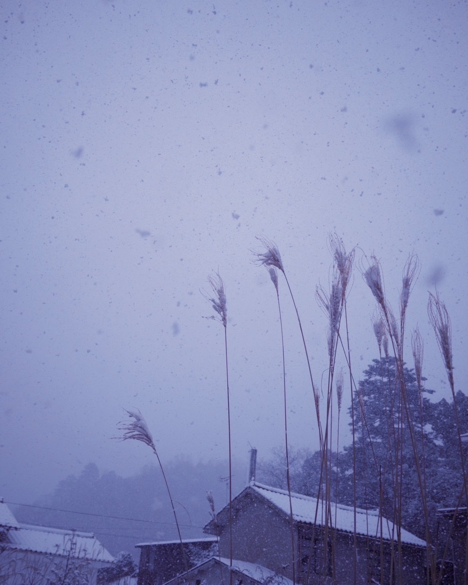

# 新雪
# Shinsetsu  
# Salju baru  

2024.01.30

やっほう  
Yahhō  
Halo!  

しばらく更新せずにお待たせしてしまってごめんなさい。  
Shibaraku kōshin sezu ni omatase shite shimatte gomennasai.  
Maaf sudah lama tidak memperbarui dan membuatmu menunggu.  

今日からまた日記を書いていくね。  
Kyō kara mata nikki o kaite iku ne.  
Mulai hari ini, aku akan menulis diary lagi.  

.jpg)

.jpg)

思いつきで、この間鳥取県に行ってきました。  
Omoitsuki de, kono aida Tottori-ken ni itte kimashita.  
Tiba-tiba terpikirkan, aku pergi ke Prefektur Tottori beberapa waktu lalu.  

これらはその時の写真  
Korera wa sono toki no shashin  
Ini adalah foto-foto dari saat itu.  

1泊のつもりが、大雪で列車もバスも飛行機も止まってしまって結局3日間閉じ込められて居ました。  
Ippaku no tsumori ga, ōyuki de ressha mo basu mo hikōki mo tomatte shimatte kekkyoku mikka-kan tojikomerarete imashita.  
Awalnya hanya berniat menginap satu malam, tapi karena hujan salju lebat, kereta, bus, dan pesawat semuanya berhenti, aku akhirnya terjebak selama tiga hari.  

雪を降らし続ける分厚い雲に覆われた空を眺めていたら自分の心が落ち着いていることに気付いて面白かった  
Yuki o furashi tsudzukeru buatsui kumo ni ōwareta sora o nagamete itara jibun no kokoro ga ochitsuite iru koto ni kizuite omoshirokatta  
Saat aku memandangi langit yang tertutup awan tebal yang terus menurunkan salju, aku sadar hatiku terasa tenang, dan itu menarik.  

沢山絵を書いた後の汚れた筆を注ぐ絵の具バケツみたいな色の空みたいやな、  
Takusan e o kaita ato no yogoreta fude o sosogu enogu baketsu mitai na iro no sora mitai yana,  
Langitnya seperti ember cat yang dipakai mencuci kuas kotor setelah banyak melukis, ya.  

って思ったけどそういう色した空から真っ白くて新しい雪が落ちてくるのもだんだん面白い気がしてきてずっと眺めてられた  
Tte omotta kedo sō iu iro shita sora kara masshiro kute atarashii yuki ga ochite kuru no mo dandan omoshiroi ki ga shite kite zutto nagameterareta  
Aku berpikir begitu, tapi melihat salju baru yang putih bersih jatuh dari langit seperti itu terasa semakin menarik, sehingga aku terus saja memandanginya.  

あと銀河とカツ丼  
Ato Ginga to katsudon  
Juga galaksi dan katsudon.  