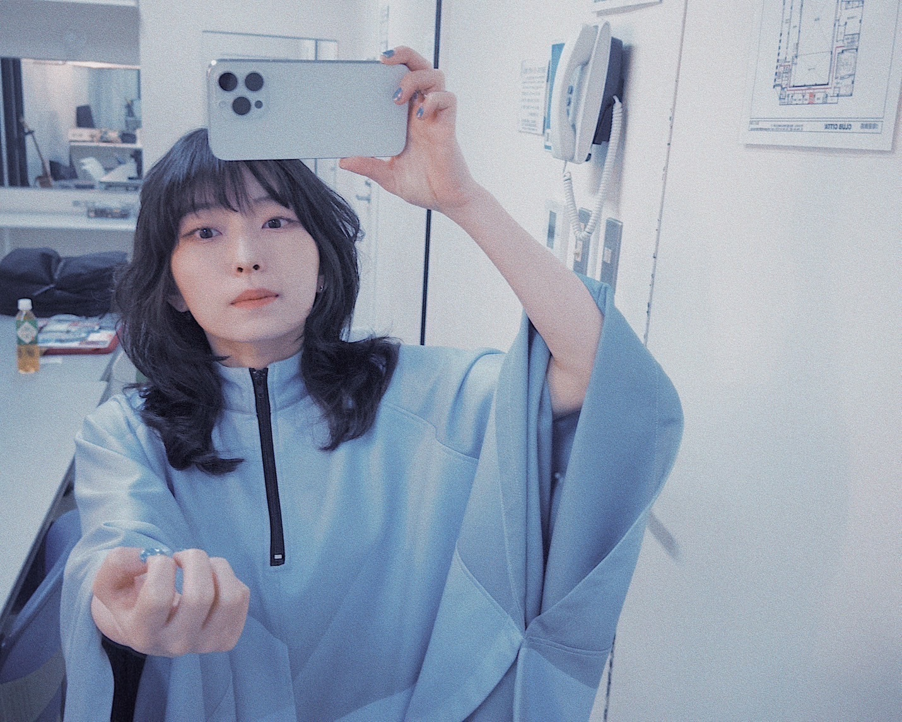

# 凡人と天才
# Bonjin to Tensai  
# Orang Biasa dan Jenius  

2024.03.03

２月２９日閏日、ライブでした。  
Ni-gatsu nijūku-nichi urūbi, raibu deshita.  
Tanggal 29 Februari, hari kabisat, ada konser.  

1.葵橋  
Aobashi  
Jembatan Aoi  

2.DAWN DANCE  
Dawn Dance  
Tarian Fajar  

3.雨  
Ame  
Hujan  

4.ちよこれいと  
Chiyokoreito  
Cokelat  

5.芸術と嘘  
Geijutsu to Uso  
Seni dan Kebohongan  

セットリストはこれでした。  
Settorisuto wa kore deshita.  
Ini adalah daftar lagunya.  

出演者全員弾き語りということだったので、ライブハウス特有の寂しげだけど鋭いあの、独特の空気が似合いそうな弾き語りが映える曲を選びました。  
Shutsuen-sha zen’in hiki-gatari to iu koto datta node, raibu hausu tokuyū no sabishige dakedo surudoi ano, dokutoku no kūki ga niaiso na hiki-gatari ga haeru kyoku o erabimashita.  
Karena semua penampil menyanyikan lagu akustik, aku memilih lagu-lagu yang cocok dengan suasana khas live house yang sedikit melankolis tapi tajam.  

爪も見せようと思って撮ったのに上手く行かなかった！  
Tsume mo miseyō to omotte totta no ni umaku ikanakatta!  
Aku ingin menunjukkan kuku juga, tapi gagal saat memotretnya!  

最後の曲は最近出来た曲で初披露でした。  
Saigo no kyoku wa saikin dekita kyoku de hatsu-hyōro deshita.  
Lagu terakhir adalah lagu baru yang baru saja dibuat, dan ini penampilan perdananya.  

よくラブソングが歌われる時の、“大切な誰かを思い浮かべて聴いてください”という前口上があるでしょ  
Yoku rabusongu ga utawareru toki no, "Taisetsu na dareka o omoi ukabete kiite kudasai" to iu maekōjō ga aru desho  
Saat menyanyikan lagu cinta, sering ada pengantar seperti, "Bayangkan seseorang yang penting bagi Anda saat mendengarkannya," kan?  

その時に思い浮かぶ大切な誰かって、その曲を聴く聴かないに関わらず人生において忘れたくても忘れられない重要人物である場合が多い気がするのね  
Sono toki ni omoi ukabu taisetsu na dareka tte, sono kyoku o kiku kikanai ni kakawarazu jinsei ni oite wasuretakute mo wasurerarenai jūyō jinbutsu de aru baai ga ōi ki ga suru no ne  
Orang yang muncul di pikiran saat itu biasanya adalah seseorang yang penting dalam hidup, yang meskipun ingin dilupakan, sulit untuk dihapus dari ingatan.  

だけどこの曲を聴いた人の中に思い浮かぶ何かがあるとしたら、それは人生でほとんど思い出すきっかけがないような、ありふれた日常の遠い記憶の中の誰かなんじゃないかと思ったりする  
Dakedo kono kyoku o kiita hito no naka ni omoi ukabu nanika ga aru to shitara, sore wa jinsei de hotondo omoidasu kikkake ga nai yō na, arifureta nichijō no tōi kioku no naka no dareka nan ja nai ka to omottari suru  
Namun, jika lagu ini memunculkan sesuatu di benak seseorang, mungkin itu adalah seseorang dalam kenangan jauh dari kehidupan sehari-hari yang jarang teringat.  

友達にすらなれなかったクラスメイトとか遠くのいじめとか諦めとか居眠りとか雲の形とか一回きりで終わった習い事とかデートとか別に思い出す必要がないこと  
Tomodachi ni sura narenakatta kurasumeito toka tōku no ijime toka akirame toka inemuri toka kumo no katachi toka ikkai kiri de owatta narai-goto toka dēto toka betsu ni omoidasu hitsuyō ga nai koto  
Seperti teman sekelas yang bahkan tidak sempat menjadi teman, perundungan jauh, keputusasaan, tidur siang, bentuk awan, pelajaran yang hanya sekali, kencan—hal-hal yang sebenarnya tidak perlu diingat.  

しかし“必要”ってなんだろうね　考えれば考えるほどわからなくなるのですし  
Shikashi "hitsuyō" tte nandarō ne kangaereba kangaeru hodo wakaranaku naru no desu shi  
Namun, apa itu "kebutuhan"? Semakin aku memikirkannya, semakin aku tidak mengerti.  

そんなものをどうしても作んなきゃいけないって思ったことも不思議でしょうがないんだけどさ  
Sonna mono o dōshitemo tsukunnakya ikenai tte omotta koto mo fushigi deshō ga nai n da kedo sa  
Aku juga merasa aneh mengapa aku merasa harus membuat sesuatu seperti itu.  

じゃあ、この曲は娯楽になるだろうかあ？とかなんとか  
Jā, kono kyoku wa goraku ni naru darou ka? Toka nantoka  
Jadi, apakah lagu ini bisa menjadi hiburan? Atau semacam itu.  

歌詞  
Kashi  
Lirik.  

.jpg)

.png)

.png)

.png)