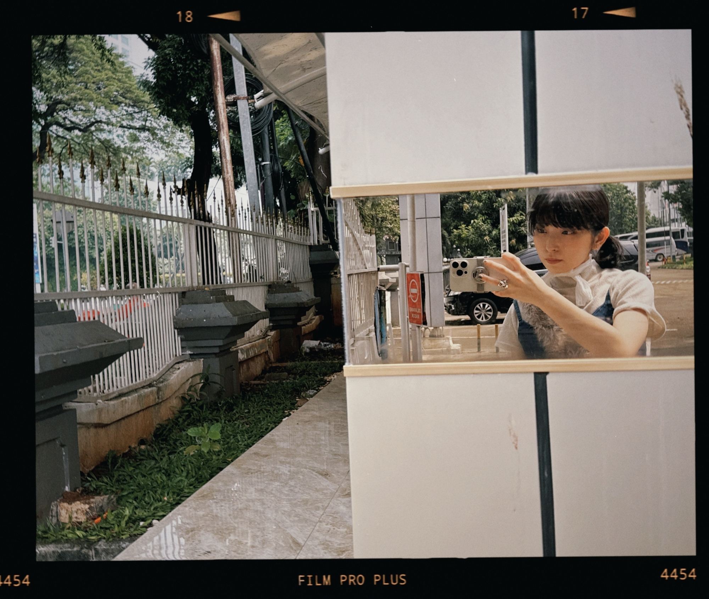

# ゆりかご
# Yurikago
# Buaian

2024.05.09

声帯に痰がくっついて取れなくなってて、声を出すことの邪魔をしている。腹立たしいです。  
Seitai ni tan ga kutsuite torenaku natte te, koe o dasu koto no jama o shite iru. Haratadashii desu.  
Lendir menempel di pita suara dan tidak mau lepas, menghalangi suara keluar. Menyebalkan.  

とにかく出来ることを粛々と行って水をたくさん飲んで薬を服用し切るしかない。  
Tonikaku dekiru koto o shukushuku to okonatte mizu o takusan nonde kusuri o fukuyō shikiru shika nai.  
Yang bisa dilakukan hanyalah tetap tenang, minum banyak air, dan menyelesaikan pengobatan.  

こういう時にすぐ不安で焦ってしまうんだけど、  
Kō iu toki ni sugu fuan de asette shimau n da kedo,  
Dalam situasi seperti ini, aku mudah merasa cemas dan panik.  

もう少し上手くペースを整えたり、それはそれでと気持ちの持ち様で軽やかに前向きに過ごせたらいいな  
Mō sukoshi umaku pēsu o totonoetari, sore wa sore de to kimochi no mochiyō de karoyaka ni maemuki ni sugosetara ī na.  
Aku berharap bisa lebih baik menyesuaikan ritme dan tetap positif, dengan cara yang ringan dan penuh penerimaan.  

それが難しいんだよなーー  
Sore ga muzukashii n da yo na––  
Tapi itu sulit, ya––.  

と不安を  
To fuan o  
Dengan menuliskan kecemasan ini,  

書き起こすことで心を柔らかい方へ揺すぶってみる。  
Kakiokosu koto de kokoro o yawarakai hō e yusubutte miru.  
Aku mencoba menggoyang hati ke arah yang lebih lembut.  

そうだ、  
Sō da,  
Oh iya,  

言葉と、言葉を垂れ流す先のこの世界は、  
Kotoba to, kotoba o tarenagasu saki no kono sekai wa,  
Kata-kata, dan dunia tempat kata-kata itu mengalir,  

自分を揺り動かしてくれる面白くてへんてこなゆりかごであってほしいね  
Jibun o yuri ugokashite kureru omoshirokute henteko na yurikago de atte hoshii ne.  
Semoga menjadi buaian yang aneh dan menarik, yang menggoyangkan diriku.  

だから  
Dakara  
Makanya,  

書くことは大事  
Kaku koto wa daiji  
Menulis itu penting.  

描くことは大事  
Egaku koto wa daiji  
Menggambar itu penting.  

欠くことも大事  
Kaku koto mo daiji  
Kehilangan juga penting.  

「言葉が降り積もるものだとしたら、  
“Kotoba ga furitsumoru mono da to shitara,  
“Jika kata-kata menumpuk seperti salju,  

あなたはどんな言葉を未来の世代に残したいですか」って  
Anata wa donna kotoba o mirai no sedai ni nokoshitai desu ka” tte  
Kata-kata apa yang ingin kamu tinggalkan untuk generasi mendatang?”  

昨日読み始めた本の袖の部分に書いてて、  
Kinō yomihajimeta hon no sode no bubun ni kaite te,  
Itu tertulis di bagian sampul buku yang mulai aku baca kemarin,  

それで  
Sore de  
Lalu,  

自分にとっての言葉って何だろうって考えてたところです  
Jibun ni totte no kotoba tte nan darō tte kangaeteta tokoro desu.  
Aku jadi berpikir, apa arti kata-kata bagiku.  

何か心を言葉にしてみようとする時はその内容が不安だとしても怒りだとしても、  
Nanika kokoro o kotoba ni shite miyō to suru toki wa sono naiyō ga fuan da to shite mo ikari da to shite mo,  
Ketika mencoba menuangkan hati ke dalam kata-kata, meskipun isinya kecemasan atau amarah,  

言葉にした時の揺り動きが、わたしと君を救うものであると信じているよ  
Kotoba ni shita toki no yuri ugoki ga, watashi to kimi o sukuu mono de aru to shinjite iru yo.  
Aku percaya, getaran yang tercipta saat kata-kata itu ditulis bisa menyelamatkan kita berdua.  

そのためには確実に自分を傷付けるような言葉の使い方に慣れてしまわんでほしいと思う  
Sono tame ni wa kakujitsu ni jibun o kizutsukeru yō na kotoba no tsukaikata ni narete shimawan de hoshii to omou.  
Karena itu, aku berharap kamu tidak terbiasa menggunakan kata-kata yang pasti akan menyakitimu.  

確実なのは毒なんだ  
Kakujitsu na no wa doku nan da.  
Hal yang pasti itu adalah racun.  

閑話休題  
Kanwa kyūdai  
Ngomong-ngomong,  

今日東京は豪雨でした  
Kyō Tōkyō wa gōu deshita.  
Hari ini Tokyo diguyur hujan deras.  

ゴールデンウィークはインドネシアにライブをしに行きました。  
Gōruden Wīku wa Indoneshia ni raibu o shi ni ikimashita.  
Saat Golden Week, aku pergi ke Indonesia untuk konser. 

多くのお客さんが、私の曲を覚えていてびっくりした  
Ōku no okyakusan ga, watashi no kyoku o oboeteite bikkuri shita  
Banyak tamu yang mengingat lagu saya, dan saya terkejut.  

覚えることは愛のひとつですね  
Oboeru koto wa ai no hitotsu desu ne  
Menghafal sesuatu adalah salah satu bentuk cinta, ya.  

トィリマカシーっていうのが、ありがとうって意味なんですけど  
Toirimakashī tte iu no ga, arigatō tte imi nan desu kedo  
"Terima kasih" artinya adalah "terima kasih".  

とにかく忘れないでおこうってまじないみたいに唱えまくってました。  
Tonikaku wasurenaide okō tte majinai mitai ni tonaemakutte mashita.  
Pokoknya, saya terus mengucapkannya seperti mantra agar tidak lupa.  

あと  
Ato  
Selain itu,  

泊まったホテルから歩いて5分位の近所に、射撃場があったんですね  
Tomatta hoteru kara aruite gofun gurai no kinjo ni, shagekijō ga attan desu ne  
Sekitar 5 menit berjalan kaki dari hotel tempat saya menginap, ada lapangan tembak.  

面白そうだなあと思って、本物のピストルを撃ってきました。  
Omoshirosō da naa to omotte, honmono no pisutoru o utte kimashita.  
Terlihat menarik, jadi saya mencoba menembakkan pistol asli.  

インドネシアでの様子は後日vlogをアップしますね。  
Indoneshia de no yōsu wa gojitsu vurogu o appu shimasu ne.  
Saya akan mengunggah vlog tentang pengalaman saya di Indonesia nanti.  