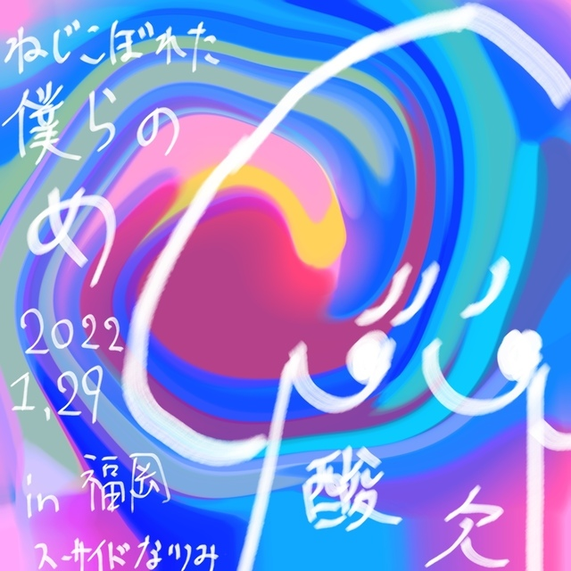

# カラフルな世界に迷い込んだ酸欠イカちゃん  
# Karafuru na sekai ni mayoikonda sanketsu ika-chan  
# Sanketsu Ika-chan yang tersesat di dunia penuh warna  

2022.02.15

ニックネーム：スーサイドなっちゃん  
Nikkuneemu: Suusaido Nacchan  
Nama panggilan: Suicide Nacchan  

カラフルな世界に迷い込んだ酸欠イカちゃんを描きました！さて、酸欠イカちゃんはこのカラフルな世界から抜け出せらのか…？それは誰もわからない…。  
Karafuru na sekai ni mayoikonda sanketsu ika-chan o kakimashita! Sate, sanketsu ika-chan wa kono karafuru na sekai kara nukedaserareru no ka…? Sore wa daremo wakaranai…  
Saya menggambar Sanketsu Ika-chan yang tersesat di dunia penuh warna! Nah, apakah Sanketsu Ika-chan bisa keluar dari dunia penuh warna ini...? Itu tidak diketahui oleh siapa pun...  

ねじこぼれた僕らのめ　2022.1.29 in福岡  
Nejikoboreta bokura no me 2022.1.29 in Fukuoka  
"Nejikoboreta Bokura no Me" pada 2022.1.29 di Fukuoka  

の記念にこちらのイラストを描かせていただきました。  
No kinen ni kochira no irasuto o kakasete itadakimashita.  
Sebagai peringatan, saya menggambar ilustrasi ini.  

さユりちゃんの描くキャラクター達はどれも魅力的で可愛いくてゆるくて好きです。  
Sayuri-chan no kaku kyarakutaa-tachi wa dore mo miryokuteki de kawaikute yurukute suki desu.  
Karakter-karakter yang digambar Sayuri-chan semuanya menarik, lucu, dan santai, saya sangat menyukainya.  

その中でも特に好きなのが酸欠イカちゃんが好きで、今回書いてみました！！  
Sono naka demo toku ni suki na no ga sanketsu ika-chan ga suki de, konkai kaite mimashita!!  
Dari semua itu, yang paling saya suka adalah Sanketsu Ika-chan, jadi kali ini saya mencoba menggambarnya!!  

ライブとってもとっても素敵な時間でした。  
Raibu tottemo tottemo suteki na jikan deshita.  
Konsernya adalah momen yang sangat-sangat indah.  

また会える日を楽しみに日々を暮らします。  
Mata aeru hi o tanoshimi ni hibi o kurashimasu.  
Saya akan menjalani hari-hari dengan menantikan saat kita bertemu lagi.  

また会える日まで…！！  
Mata aeru hi made…!!  
Sampai hari kita bertemu lagi...!!  