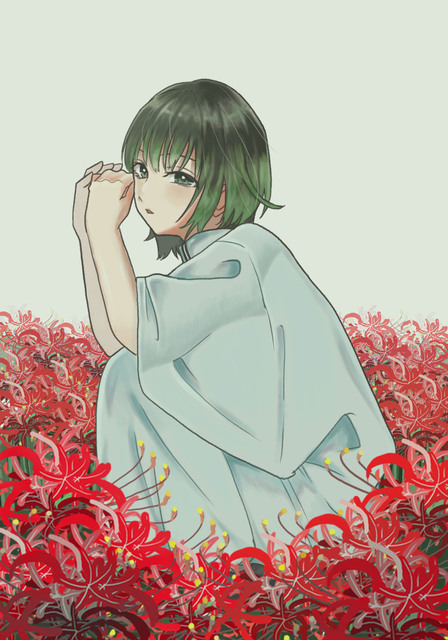

# また会える日を楽しみに  
# Mata aeru hi o tanoshimi ni  
# Menantikan hari kita bisa bertemu lagi  

2022.08.04

ニックネーム：ゆうり  
Nikkunēmu: Yuuri  
Nama panggilan: Yuuri  

テーマ「植物」とのことで、曼珠沙華(彼岸花)とさユりさんを描かせていただきました！  
Tēma "shokubutsu" to no koto de, manjushage (higanbana) to Sayuri-san o egakase te itadakimashita!  
Dengan tema "tanaman," saya menggambar Sayuri-san bersama bunga manjushage (higanbana)!  

タイトルは彼岸花の花言葉。文字通り、わたしもまたさユりさんに会える日を楽しみに生きていたいと思いを込めて描きました。  
Taitoru wa higanbana no hanakotoba. Moji-dōri, watashi mo mata Sayuri-san ni aeru hi o tanoshimi ni ikite itai to omoi o komete egakimashita.  
Judulnya diambil dari arti bunga higanbana. Seperti maknanya, saya ingin hidup dengan menantikan hari di mana saya bisa bertemu Sayuri-san lagi, dan menggambar dengan perasaan itu.  