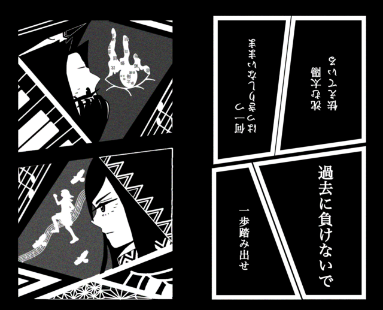

# 夜明けの詩  
# Yoake no Uta  
# Puisi Fajar  

2022.01.19

ニックネーム：柚子  
Nikkuneemu: Yuzu  
Nama panggilan: Yuzu  

「過去に負けないで 一歩踏み出せ」という歌詞が大好きです。  
"Kako ni makenai de ippo fumidase" to iu kashi ga daisuki desu.  
Saya sangat menyukai lirik "Jangan kalah dengan masa lalu, ambil satu langkah ke depan."  

辛いことがあっても、なかなか上手くいかなくても、  
Tsurai koto ga atte mo, nakanaka umaku ikanakute mo,  
Meskipun ada hal yang menyakitkan atau sulit untuk berjalan dengan baik,  

それでも立ち止まらず前に進まなきゃいけないときに勇気を与えてくれる、  
Soredemo tachidomarazu mae ni susumanakya ikenai toki ni yuuki o ataete kureru,  
Lagu ini memberikan keberanian saat saya harus terus maju tanpa berhenti,  

私に取っておまもりのような曲です。  
Watashi ni totte omamori no youna kyoku desu.  
Bagi saya, lagu ini seperti jimat pelindung.  